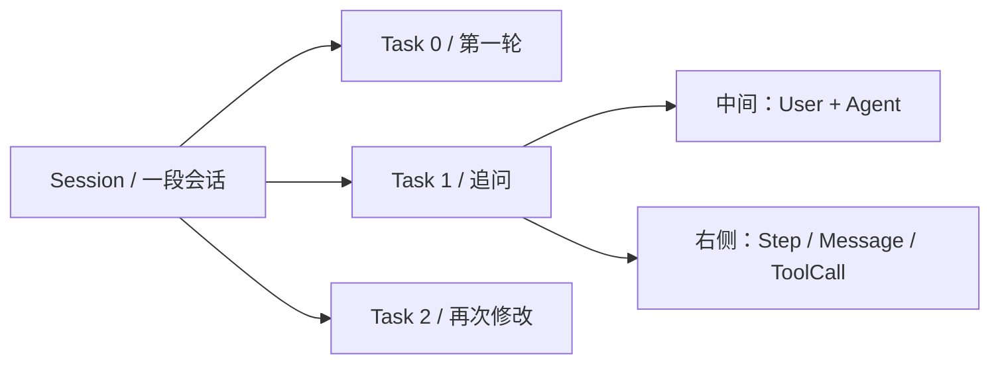
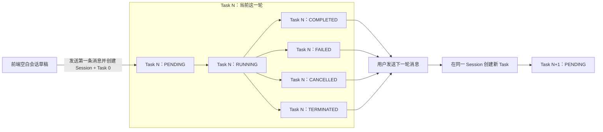
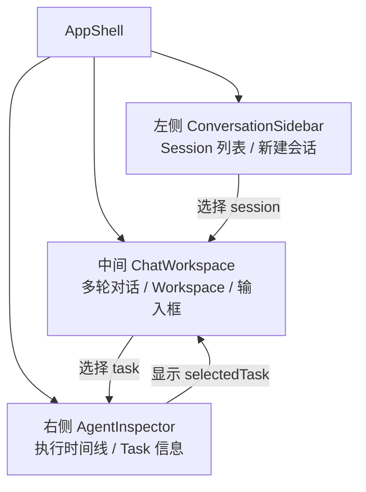

# 编程智能体前端多轮会话设计

> 状态：第 10 步实现基线。本文固定的多轮会话语义、三栏信息架构和主要交互已经在后端与前端实现；真实浏览器验收状态以《第 10 步在线纵向验收记录》为准。

配套的三张蓝白界面设计稿见 [前端多轮会话设计稿 HTML](./构建编程智能体V2-4-前端多轮会话设计稿.html)。HTML 是独立静态文档，不依赖 `frontend/` 工程。

## 1. 核心对象映射

| 产品概念 | 系统对象 | 页面位置 | 语义 |
| --- | --- | --- | --- |
| 一段会话 | `Session` | 左侧会话栏的一行 | 组织多轮相关任务 |
| 一轮用户与 Agent 对话 | `Task` | 中间对话区的一组 User/Agent 消息 | 一次完整 Agent 执行生命周期 |
| 一轮内部执行过程 | `AgentStep`、`Message`、`ToolCall` | 右侧执行检查器 | 展示该 Task 如何得到结果 |



## 2. 已固定的产品语义

### 2.1 新建会话

Session 的持久化结构固定为：

```text
Session
├── id
├── title
├── created_at
├── updated_at
└── Tasks
```

- 点击“新建会话”只创建前端空白草稿。
- 用户发送第一条消息时，才在服务端创建 `Session` 和第一个 `Task`。
- 用户未发送内容便离开时，数据库中不留下空 Session。
- `Session.title` 是持久化字段，不是查询时临时生成的 DTO 字段。
- title 根据第一条 Prompt 确定性生成，不调用模型。
- title、Session 和第一个 Task 在同一数据库事务中创建；任意一步失败时整体回滚。
- 后续 Task 不修改 Session title。
- 当前阶段不支持用户重命名会话。
- Session API 直接返回 `title`，不使用 `display_title`。

标题生成规则固定为：

1. 对第一条 `Task.original_prompt` 去除首尾空白。
2. 将中间连续的空格、制表符和换行统一折叠为一个空格。
3. 归一化后不超过 30 个 Python 字符时，直接作为标题。
4. 超过 30 个 Python 字符时，保留前 30 个字符并追加 `…`。

示例：

```text
第一条 Task.original_prompt：
请检查这个计算器项目，
运行测试并修复所有失败用例。

生成并存入 Session.title：
请检查这个计算器项目，运行测试并修复所有失败用例。
```

第一条完整 Prompt 仍存储在第一个 Task 的 `original_prompt` 中；短标题存储在
`Session.title` 中。二者语义不同：前者是 Agent 的完整任务输入，后者是左侧会话栏
使用的稳定展示名称。查询会话列表时直接读取 `Session.title`，不再重新读取或截断
第一条 Prompt。

### 2.2 同一 Session 的运行约束

- 同一 Session 同一时间只允许一个 `PENDING` 或 `RUNNING` Task。
- 当前 Task 未进入终态时，中间输入框禁用。
- 运行中只提供“取消当前任务”，不允许提交并发任务或排队任务。
- Task 状态全部以服务端返回值为准，前端不根据时间、消息数量或工具结果自行推导。
- 每个 Task 只能从 `PENDING` 进入 `RUNNING`，再进入一个终态；终态 Task
  永远不会重新变成 `PENDING` 或 `RUNNING`。
- 当前 Task 进入终态后，用户发送下一轮消息会在同一个 Session 下创建一个新的
  Task。新 Task 的初始状态是 `PENDING`，旧 Task 保持原终态。



图中的 `Task N` 和 `Task N+1` 是两条不同的数据库记录。不存在
`COMPLETED → PENDING` 或 `FAILED → PENDING` 这样的单 Task 状态回退。

Session 当前没有独立生命周期状态。左侧会话栏显示的“运行中”“已完成”等状态，
只是服务端返回的该 Session 最新 Task 状态摘要，不会修改任何历史 Task。

### 2.3 Workspace

- Workspace 表示“下一轮 Task 使用的服务端本地目录”。
- Workspace 不是浏览器上传目录。
- 每个 Task 保存自己实际使用的 Workspace。
- 修改 Workspace 只影响下一轮 Task，不修改历史 Task。
- 当前 Task 运行期间不能修改 Workspace。
- Workspace 是否存在、是否越界以及是否为目录，继续由服务端校验。

### 2.4 Task 选择联动

- 中间每轮 User/Agent 对话对应一个 Task。
- 点击任意一轮后，该 Task 成为 `selectedTask`。
- 右侧执行检查器只展示 `selectedTask` 的 Step、Message、ToolCall 和 Task 信息。
- 新 Task 开始运行后默认自动选中它；用户仍可主动查看已经完成的历史 Task。
- 中间区和右侧区必须共享同一份 Task 快照，不能各自独立推导状态。

### 2.5 左右侧栏

- 左侧会话栏和右侧执行检查器可以独立折叠并完全消失。
- 折叠按钮保留在中间顶部栏。
- 折叠状态仅保存到浏览器 `localStorage`，不写数据库。
- 折叠状态不是业务数据，不需要 Web API。

### 2.6 页面地址

页面使用查询参数恢复选择状态：

```text
/?session=<session_id>&task=<task_id>
```

- `session` 决定当前打开的会话。
- `task` 决定右侧检查器当前展示的 Task。
- 只有 `session` 时，默认选择该 Session 最新的 Task。
- 两者都没有时，进入空白新会话草稿。
- 当前只有一个工作台页面，暂不引入 React Router，使用浏览器 History API 更新查询参数。

## 3. 最终三栏信息架构



推荐桌面尺寸：

| 区域 | 展开宽度 | 折叠行为 |
| --- | ---: | --- |
| 左侧会话栏 | 260 px | 完全消失 |
| 中间对话区 | `minmax(560px, 1fr)` | 始终保留 |
| 右侧执行检查器 | 380 px | 完全消失 |

## 4. 三张界面设计稿

### 4.1 空白新会话

对应 HTML 中的“01 空白新会话”。

- 左侧展示已有会话，新建会话处于选中状态。
- 空白草稿尚无 Session ID，也没有数据库记录。
- 中间展示产品引导、Workspace 和输入框。
- 右侧展示空状态，提示发送任务后出现执行时间线。
- 发送第一条消息才创建 Session + Task。

### 4.2 Task 运行中

对应 HTML 中的“02 Task 运行中”。

- 左侧当前会话显示 `RUNNING` 状态点。
- 中间显示用户 Prompt、Agent 运行摘要和工具调用数量。
- 输入框与 Workspace 控件禁用，操作按钮变为“取消当前任务”。
- 右侧展示当前 Task 的 Step 时间线、ToolCall 状态和 Task 信息。
- 普通工具错误仍作为 Observation 展示，不把 Task 直接标成失败。

### 4.3 多轮对话完成并查看历史 Task

对应 HTML 中的“03 多轮完成与历史查看”。

- 中间展示同一 Session 的多轮 User/Agent 对话。
- 被选中的历史 Task 使用轻量蓝色边框标识。
- 右侧展示被选中历史 Task 的完整执行过程，而不是始终展示最新 Task。
- 当前 Session 没有运行中 Task 时，输入框和 Workspace 恢复可用。
- 历史 Task 的 Workspace 保持原值；输入区 Workspace 只代表下一轮。

## 5. 信息展示边界

### 左侧只展示

- 服务端返回的 `Session.title`；
- 最近更新时间；
- 最新 Task 状态；
- 当前选中态。

当前阶段不展示删除、重命名、搜索、置顶和文件夹功能。

### 中间只展示

- `Task.original_prompt`；
- Task 运行摘要；
- `Task.final_answer`；
- `Task.error` 或 `termination_reason`；
- 工具调用数量摘要和“查看执行过程”入口。

完整工具参数、文件内容、stdout 和 stderr 默认不进入对话正文。

### 右侧只展示

- `selectedTask` 状态；
- AgentStep 时间线；
- Assistant Tool Call；
- ToolCall 参数、状态和 Tool Result；
- Task ID、Workspace、开始/结束时间、错误和终止原因。

长 Tool Result 默认折叠，用户展开后查看。

## 6. 组件信息架构

```text
AppShell
├── ConversationSidebar
│   ├── NewConversationButton
│   ├── ConversationList
│   └── ConversationListItem
├── ChatWorkspace
│   ├── ChatHeader
│   ├── ConversationFeed
│   │   ├── UserTurn
│   │   └── AgentTurn
│   └── Composer
│       ├── WorkspaceControl
│       ├── PromptInput
│       └── SubmitOrCancelAction
└── AgentInspector
    ├── InspectorHeader
    ├── AgentTimeline
    │   └── StepCard
    │       └── ToolCallCard
    └── TaskDetails
```

## 7. 统一视觉基线

- 风格：蓝白、简约、工具感，避免大量宣传页装饰。
- 中间对话区保持最高视觉优先级，左右侧栏使用更浅背景。
- 主色：`#2563EB`。
- 主文字：`#172033`。
- 次级文字：`#64748B`。
- 页面背景：`#F5F8FD`。
- 卡片背景：`#FFFFFF`。
- 边框：`#DCE5F2`。
- 完成：绿色；失败：红色；拒绝/终止：橙色；运行中：蓝色；等待：灰蓝色。
- 对话正文最大阅读宽度建议为 820 px。
- Step 和 ToolCall 使用信息密度较高的小卡片；长日志使用等宽字体。
- 桌面同时显示三栏；平板默认折叠左栏；手机将左右栏转换为抽屉。

## 8. 当前实现与设计稿的关系

正式前端已经按照本设计完成重构：

- `AppShell` 实现左侧 Session、中间多轮对话和右侧 Agent 执行检查器；
- 第一条消息创建 Session，后续消息在同一 Session 下创建新 Task；
- Session 与 Task 选择写入 URL 查询参数，刷新后从服务端恢复；
- 中间对话区和右侧检查器共享同一份 Task Snapshot；
- 需要批准的命令在右侧 ToolCall 卡片中展示完整 argv、规范工作目录、风险规则和指纹，并支持一次性允许或拒绝；
- 左右侧栏可独立折叠，折叠状态保存在 `localStorage`；
- 桌面使用三栏，平板和手机按设计切换为折叠栏或抽屉；
- 早期宣传式提交页、提交卡片和单 Task 占位页已经移除。

静态 HTML 继续作为视觉基线，不参与正式前端运行。

## 9. 本设计明确不实现

- WebSocket/SSE；
- 在线文件编辑器；
- Git diff 回滚；
- 多用户鉴权；
- 会话删除、重命名和搜索；
- 同一 Session 的并发 Task 或排队；
- 容器沙箱。

## 10. 设计验收条件

- 三张设计稿使用同一套颜色、间距和组件语言。
- 新建会话不会在发送前产生数据库记录。
- 运行中界面明确禁用下一轮输入，并提供取消入口。
- 历史 Task 和下一轮 Workspace 的语义不会混淆。
- 中间选中的 Task 与右侧执行过程保持一致。
- 左右侧栏的折叠不影响中间对话和 Task 运行。
- 页面刷新所需的 Session/Task 选择可以由 URL 表达。
- 设计中不存在后端尚未支持却看似可用的按钮。
